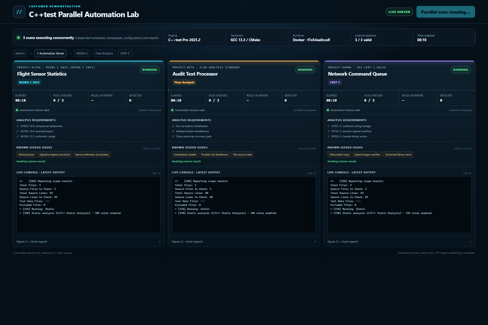

# C++test Parallel Automation Lab

Customer deployment and reconstruction instructions are available as [Markdown](CUSTOMER_GUIDE.md) and as a [customer-ready PDF](CppTest_Parallel_Automation_Customer_Guide.pdf).

A customer-facing proof of concept for consolidating multiple C++test Standard analysis workers onto one C++test Professional Automation host. It launches three independent analyses concurrently and visualizes their process state, Automation license activation, console output, requirements, findings, and reports.

The repository is MIT licensed. Parasoft C/C++test and its rule configurations are commercial software and are not included.

## Demonstrated architecture

```text
Jenkins
   └── one Windows Automation host
         ├── project-alpha: MISRA C 2023
         ├── project-beta:  Flow Analysis
         └── project-gamma: SEI CERT C
```

Every branch has a separate source tree, CMake build, C++test workspace, report directory, and process. The only shared resources are the Automation installation, host CPU/RAM, and network license service.

## Verified result

On the reference Windows host, all three C++test Professional 2025.1 processes overlapped for approximately 32 seconds in the initial concurrency test. Each process exited successfully and independently logged:

- `Activating Automation Compliance Edition`
- `Automation feature: License is valid`

A subsequent dashboard run produced three successful reports with different findings:

| Project | Configuration | Files | Rules in report | Findings |
| --- | --- | ---: | ---: | ---: |
| Flight Sensor Statistics | MISRA C 2023 | 3 | 385 | 26 |
| Audit Text Processor | Flow Analysis Standard | 3 | 105 | 2 |
| Network Command Queue | SEI CERT C | 3 | 193 | 4 |

This proves concurrent execution on this installation. Production capacity still depends on the purchased concurrent-use entitlement, project size, analysis configuration, memory, CPU, and DTP License Server policy.

## Dashboard

From PowerShell:

```powershell
.\scripts\start-dashboard.ps1
```

Open `http://localhost:8765`. Select **Start parallel scan** to launch the three real C++test processes. The Python server uses only the standard library.

The static site in `docs/` is also published through GitHub Pages. Since GitHub Pages cannot run a licensed local scanner, it switches to a clearly labeled **Public Replay** mode with representative data. Replay values are not presented as live scanner evidence.

## Docker demonstration

The live dashboard can run inside one Docker container and launches all three scanner processes in that same container. It detects `/.dockerenv` and displays the container hostname/ID, Linux platform, C++test version, toolchain, scanner PIDs, license state, console output, and reports.



The image intentionally excludes commercial Parasoft software. On the reference machine, the existing WSL installation is streamed once into a private local Docker volume:

```powershell
docker volume create cpptest-linux-2025-2
cmd /c "wsl.exe tar -C /home/danie/parasoft -cf - cpptest | docker run --rm -i -v cpptest-linux-2025-2:/opt/parasoft ubuntu:24.04 tar -C /opt/parasoft -xf -"
```

The volume can contain license credentials. Keep it private and never publish or export it. Build and start the dashboard container:

```powershell
docker compose up -d --build
Start-Process http://localhost:8876
```

Select **Start parallel scan**. Independent command-line evidence is available while the scan runs:

```powershell
docker top cpptest-parallel-demo -eo pid,ppid,comm,args
docker stats cpptest-parallel-demo --no-stream
docker inspect cpptest-parallel-demo
```

The verified Docker run observed three C++test JVMs, three valid Automation sessions, and a 24-second interval when all scanners overlapped. All three exited successfully with findings 26, 2, and 4.

## Direct concurrency verification

Windows:

```powershell
.\scripts\run-parallel-test.ps1
```

The script fails unless all three scanner intervals overlap and all processes exit successfully. It writes timestamps and exit codes to `logs\parallel-test-result.json`, with reports under `reports\<project>\report.html`.

WSL or Linux:

```bash
bash scripts/run-parallel-test-linux.sh
```

The Linux runner defaults to C++test under `/home/danie/parasoft/cpptest`, compiler family `gcc_13-64`, and output under `/tmp/xsightlab-automation`. Override these with `CPPTEST_HOME`, `CPPTEST_COMPILER_FAMILY`, and `OUTPUT_ROOT`. The generated `parallel-test-result.json` records overlap, license validation, file counts, rule counts, findings, durations, and exit codes.

## Local prerequisites

- Windows PowerShell 5.1 or PowerShell 7
- CMake and MinGW GCC supported by the installed C++test compiler catalog
- C++test Professional Automation with a valid network license
- Python 3 for the dashboard
- Jenkins with Pipeline and Timestamper plugins for the CI demonstration

Defaults match the reference machine. Override them when needed:

```powershell
$env:CPPTEST_CLI = 'C:\path\to\cpptestcli.exe'
$env:CPPTEST_CONFIG_DIR = 'C:\path\to\cpptest\configs\builtin'
$env:DEMO_GCC = 'C:\path\to\gcc.exe'
```

The sample uses C++test compiler family `gcc_6`. Change that property in `scripts/run-analysis.ps1` if your installed compiler catalog and GCC version differ.

## Jenkins

Create a Pipeline job from `Jenkinsfile` on a Windows agent. The three declarative parallel branches launch separate scanner processes in the allocated workspace and archive all generated reports. DTP report publishing is intentionally disabled; DTP License Server licensing remains active.

## Reference-installation warning

The tested Eclipse installation contains both 10.7.2 and 10.7.4 Parasoft plugin bundles while the licensed C++test CLI/engine is 10.7.2. The CLI consequently warns about plugin compatibility and prints `0 rules enabled` in one phase header even though the generated report XML contains rule catalogs and real violations. The dashboard discloses this discrepancy and treats report XML as the result source.

Use a clean, version-matched C++test Professional installation before treating this as a production qualification or comparing finding accuracy.
